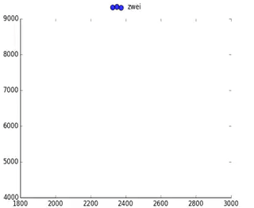

# Zwei

Video transmission algorithms should be designed to transmit video streams by balancing several contradicted metrics on demand. However, existing techniques have largely used a goal that linearly combines several weighted metrics, who often restricted mutually, which might eventually generalize a strategy that violates the original demand.

Zwei is self-play reinforcement learning algorithm that aims to tackle the video transmission tasks, which can prefectly train a policy without reward engineering.

## How to 

It's a stable version, which has already prepared the training set and the test set, and you can run the repo easily: you can jump into each folder, and just type

```
python train.py
```

instead.

We evaluate Zwei in various scenarios, not only video transmission but also general gym environment.

## Mountain Car

Here's a simple example for Zwei. Consider, we aim to teach the agent to learn the mountain car environment.
Intuitively, state-of-the-art reinforcement learning algorithm PPO can tackle this challenge in a few steps, since the goal is to maximize the overall reward.

Now let's change the challenge to: **1) touch the left margin, and 2) further, achieve the original goal.** We can see that traditional reinforcement learning fails to achieve it.
In contrast, Zwei can perfectly solve the problem, see the figure below.

<p align="center">
    
</p>

## Cartpole

In this scenario, we prove the simplest Zwei can solve the traditional reward-based RL problem.


## ABR (Adaptive Bit Rate Algorithm)

In this scenario, users often adopts a video player to watch the video on demand. First, video contents are pre-encoded and pre-chunked as several bitrate ladders on the server. Then the video player, placed on the client side, dynamically picks the proper bitrate for the next chunk to varying network conditions. Specifically, the bitrate decisions should achieve high bitrate and low rebuffering on the entire session. We called it adaptive bitrate streaming (ABR). In other words, Zwei should generate a policy which can obtain higher video bitrate with lower rebuffering.

We provide two types of ABR scenarios, i.e., ABR-4K and ABR-HD. Notice that Zwei uses a Rule in the two ABR tasks.

## CLS (Crowd-sourced Live Streaming)

Consider, if we were the content provider and currently we had multiple content delivery networks (CDNs) with different costs and performance, how
to schedule the users’ requests to the proper CDN, aiming to provide live streaming services withing less stalling ratio and lower cost? In common, we call that crowd-sourced live streaming(CLS).

### Experimental results

We plot the CLS's training process below. The point who plotted on the down-left corner represents better policy.

<p align="center">
    
</p>

## RTC (Real-time Communication)

Besides, in our daily life, we usually chat with other users instantly via a video call namely Real-Time video Communication (RTC). The RTC system consists of a sender and a receiver. The sender deploys a UDP socket channel and sends the encoded video packets to the receiver. The receiver then feeds the messages back to the
sender through feedback channel. During the session, the sender adjusts the sending bitrate for next time period, aiming
to achieve high bitrate and low round-trip time (RTT) as well as less loss ratio.
